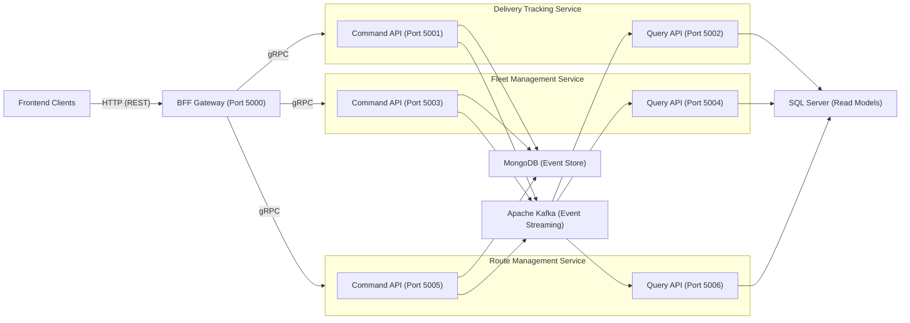
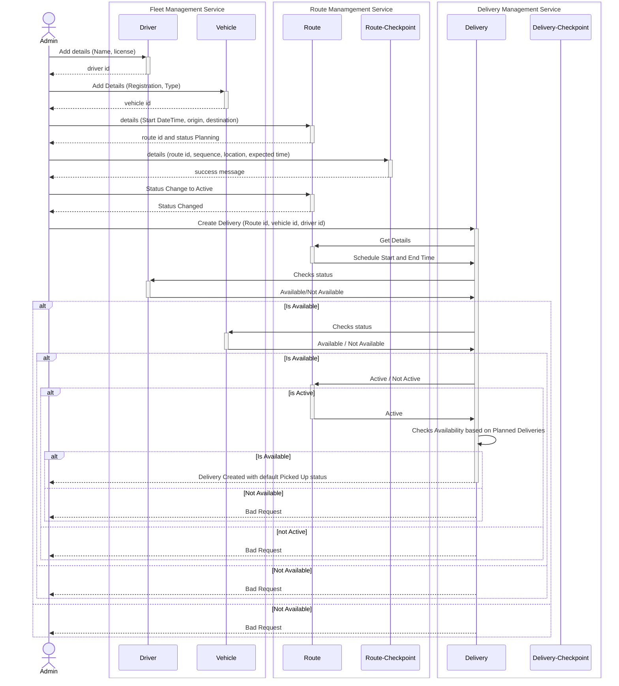
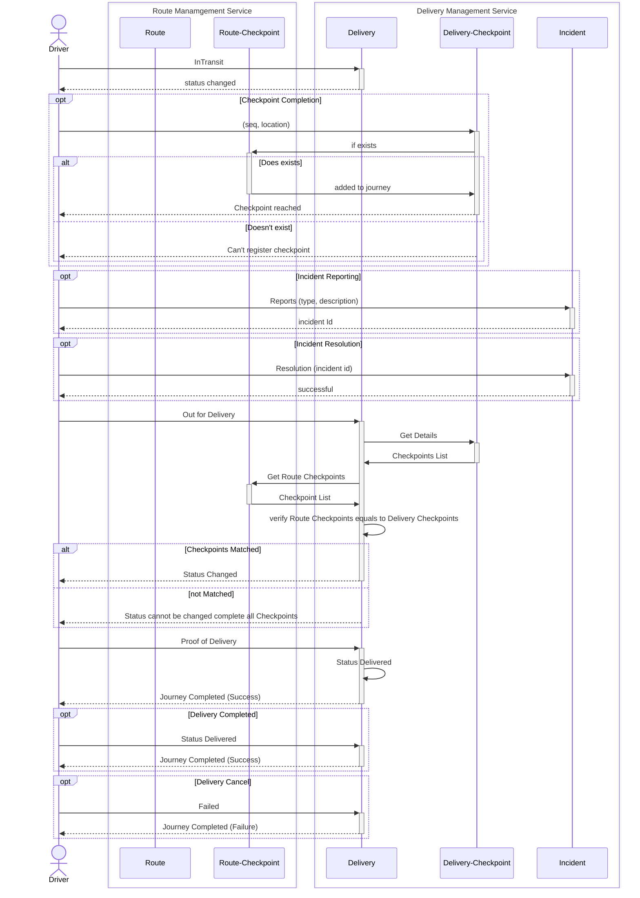

# Eroad Delivery Management System (The Great Galactic Delivery Race)

A production-ready microservices-based delivery management platform built with .NET 8, implementing Event Sourcing, CQRS, and Domain-Driven Design patterns. Features comprehensive resilience patterns, distributed locking, and clean architecture principles.

##  Architecture Overview

### Technology Stack

#### Backend Services
- **.NET 8** - Application framework
- **gRPC** - Inter-service communication
- **MediatR** - CQRS command/query handling
- **Entity Framework Core** - ORM for query databases
- **Polly v8** - Resilience pipeline (circuit breaker, retry, timeout)
- **Clean Architecture** - BFF Gateway layer separation

#### Data Storage
- **MongoDB** - Event store for Command side (Event Sourcing)
- **SQL Server** - Read models for Query side (CQRS)
- **Redis** - Distributed locking and caching

#### Messaging & Events
- **Apache Kafka** - Event streaming and pub/sub messaging
- **Event Sourcing** - Complete audit trail of all state changes

#### Containerization
- **Docker** - Container runtime
- **Docker Compose** - Multi-container orchestration

### Microservices

#### 1. Delivery Tracking Service
- **Command API** (Port 5001) - Manages delivery lifecycle
- **Query API** (Port 5002) - Delivery data queries
- **Events**: delivery-tracking-events

#### 2. Fleet Management Service  
- **Command API** (Port 5003) - Vehicle and driver management
- **Query API** (Port 5004) - Fleet data queries
- **Events**: fleet-management-events

#### 3. Route Management Service
- **Command API** (Port 5005) - Route planning and optimization
- **Query API** (Port 5006) - Route data queries  
- **Events**: route-management-events

#### 4. BFF Gateway (Port 5000)
- Backend for Frontend
- Aggregates data from multiple services
- Implements business logic orchestration
- **Resilience Features**:
  - Circuit breaker pattern (Polly v8)
  - Retry policy with exponential backoff
  - Rate limiting (100 req/10s per IP)
  - Timeout policies (30s)
- **Security & Integration**:
  - CORS configuration for frontend apps
  - Distributed locking (Redis) for concurrent operations
  - Health check endpoints for monitoring
## Architecture Diagram

### Flowchart


### Sequence Diagram

#### Delivery Creation


#### Delivery Status and Incidence

### Business Functionality Descriptions

#### Delivery Creation Business Functionality

The delivery creation process involves multiple stakeholders and services to ensure valid, conflict-free delivery assignments. An admin initiates the process by adding driver and vehicle details to the Fleet Management Service, then creates and activates a route with checkpoints in the Route Management Service. Finally, the admin creates a delivery in the Delivery Tracking Service, which validates availability of the assigned driver, vehicle, and route (must be active) against existing deliveries to prevent overlaps. If all validations pass, the delivery is created with a default "PickedUp" status; otherwise, a bad request is returned with conflict details.

#### Delivery Status and Incidence Business Functionality

Drivers manage delivery progress and report issues through the Delivery Tracking Service. They can update status to "InTransit" or "OutForDelivery", register checkpoints (validated against route checkpoints), and report/resolve incidents. For "OutForDelivery" transitions, all route checkpoints must be completed. Proof of delivery can only be captured in "OutForDelivery" status, allowing final "Delivered" status. Deliveries can also be marked as "Failed" for cancellation. Incidents are handled independently, with reporting and resolution not blocking delivery completion. All actions ensure state machine compliance and provide feedback on success or failure.

##  Getting Started

### Prerequisites

- [.NET 8 SDK](https://dotnet.microsoft.com/download/dotnet/8.0)
- [Docker Desktop](https://www.docker.com/products/docker-desktop)
- [Visual Studio Code](https://code.visualstudio.com/) or [Visual Studio 2022](https://visualstudio.microsoft.com/)

### Running with Docker Compose

#### 1. Start All Services (Infrastructure + APIs) __(Recommended)__
```powershell
docker-compose --profile init-services up -d
```

#### 2. View Logs
```powershell
docker-compose logs -f
```

#### 3. Stop Services
```powershell
docker-compose down
```

### Running Services Locally (Development)

#### 1. Start Infrastructure
```powershell
docker-compose --profile dev-services up -d
```

Note: Add kafka-kraft in your windows host file

#### 2. Run Individual Services

**Delivery Tracking Command API:**
```powershell
cd Eroad.DeliveryTracking.Command.API
dotnet restore
dotnet run
```

**Delivery Tracking Query API:**
```powershell
cd Eroad.DeliveryTracking.Query.API
dotnet restore
dotnet run
```

**BFF Gateway:**
```powershell
cd Eroad.BFF.Gateway
dotnet restore
dotnet run
```

Repeat for other services as needed.

**Note:** for building docker images use following command

```powershell
docker-compose --profile init-services build
```

##  Architecture Patterns

### CQRS (Command Query Responsibility Segregation)

**Command Side:**
- Handles write operations
- Uses Event Sourcing
- Stores events in MongoDB
- Publishes events to Kafka

**Query Side:**
- Handles read operations
- Consumes events from Kafka
- Updates SQL Server read models
- Optimized for queries

### Event Sourcing

All state changes are captured as immutable events:

```csharp
// Example: Delivery Status Change
public class DeliveryStatusChangedEvent : DomainEvent
{
    public Guid Id { get; set; }
    public DeliveryStatus OldStatus { get; set; }
    public DeliveryStatus NewStatus { get; set; }
    public DateTime ChangedAt { get; set; }
}
```

**Benefits:**
- Complete audit trail
- Event replay capability
- Temporal queries
- Easy debugging

### Domain-Driven Design (DDD)

**Aggregates:**
- `DeliveryAggregate` - Delivery lifecycle management
- `RouteAggregate` - Route planning
- `VehicleAggregate` - Vehicle management
- `DriverAggregate` - Driver management

**Domain Events:**
- `DeliveryCreatedEvent`
- `DeliveryStatusChangedEvent`
- `DriverAssignedEvent`
- `VehicleAssignedEvent`
- `ProofOfDeliveryCapturedEvent`

### State Machine Pattern

Delivery status transitions are controlled by a state machine:

**Valid Transitions:**
- PickedUp -> InTransit, Failed
- InTransit -> OutForDelivery, Failed
- OutForDelivery -> Delivered, Failed
- Delivered  (Terminal state)
- Failed -> PickedUp (retry)

##  Inter-Service Communication

### gRPC Protocol Buffers

Services communicate using gRPC for high-performance, type-safe calls:

```protobuf
service DeliveryLookup {
  rpc GetAllDeliveries(GetAllDeliveriesRequest) returns (DeliveryLookupResponse);
  rpc GetActiveDeliveriesByDriver(GetActiveDeliveriesByDriverRequest) returns (DeliveryLookupResponse);
  rpc GetActiveDeliveriesByVehicle(GetActiveDeliveriesByVehicleRequest) returns (DeliveryLookupResponse);
}
```

### Kafka Event Topics

- `delivery-tracking-events` - Delivery lifecycle events
- `fleet-management-events` - Vehicle and driver events
- `route-management-events` - Route planning events

##  Key Features

### 1. Delivery Assignment Validation

Prevents double-booking of drivers and vehicles using distributed locking:

```csharp
var (isValid, error, conflictId, start, end) = 
    await validator.ValidateDriverAvailabilityAsync(
        driverId, scheduledStart, scheduledEnd);
```

**Validation Rules:**
- Uses Redis distributed locks to prevent race conditions
- Checks active deliveries (PickedUp, InTransit, OutForDelivery)
- Detects time overlaps using interval logic
- Returns detailed conflict information for resolution
- Ensures atomicity across multiple BFF Gateway instances

**Implementation:**
- `DeliveryAssignmentValidator` - Business validation logic
- `RedisLockManager` - Distributed locking implementation
- `IDistributedLockManager` - Abstraction for testability

### 2. Status Transition Validation

State machine enforces valid delivery workflow:

```csharp
//  Valid: PickedUp  InTransit
aggregate.UpdateDeliveryStatus(DeliveryStatus.PickedUp, DeliveryStatus.InTransit);

//  Invalid: PickedUp  Delivered (skips intermediate states)
aggregate.UpdateDeliveryStatus(DeliveryStatus.PickedUp, DeliveryStatus.Delivered);
// Throws: InvalidOperationException with valid transitions message
```

### 3. Distributed Locking

Redis-based locks prevent concurrent modifications:

```csharp
await using var lockHandle = await lockManager.AcquireLockAsync(
    deliveryId, TimeSpan.FromSeconds(30));
```

### 4. Event-Driven Integration

Services react to domain events asynchronously:

```csharp
// Command side publishes event
RaiseEvent(new DeliveryStatusChangedEvent(...));

// Query side consumes event
public Task Handle(DeliveryStatusChangedEvent @event)
{
    // Update read model
}
```

### 5. Resilience Patterns (BFF Gateway)

**Circuit Breaker (Polly v8):**
- Prevents cascading failures to downstream services
- 50% failure ratio triggers circuit open
- 15-second break duration with half-open state
- Logs circuit state transitions

**Retry Policy:**
- Exponential backoff with jitter
- Maximum 3 retry attempts
- Retries on transient gRPC failures (Unavailable, DeadlineExceeded, Internal)
- 1-second initial delay

**Timeout Policy:**
- 30-second timeout per gRPC request
- Prevents resource exhaustion

**Rate Limiting:**
- Sliding window: 100 requests per 10 seconds per IP
- Queue limit: 10 requests
- Returns 429 with retry-after metadata

##  Project Structure

```
Eroad/
📁 Eroad.BFF.Gateway/                  # Backend for Frontend (Clean Architecture)
    Application/
       DTOs/                        # Data Transfer Objects
       Interfaces/                  # Service abstractions
          IDeliveryTrackingService.cs
          IFleetManagementService.cs
          IRouteManagementService.cs
          IDistributedLockManager.cs
       Services/                    # Business logic orchestration
          DeliveryTrackingService.cs
          FleetManagementService.cs
          RouteManagementService.cs
          RedisLockManager.cs
       Validators/                  # Business rule validation
          DeliveryAssignmentValidator.cs
    Presentation/
       Controllers/                 # REST API endpoints
          DeliveryManagementController.cs
          FleetManagementController.cs
          RouteManagementController.cs
       Middleware/
          ExceptionHandlingMiddleware.cs
    Program.cs                      # Startup configuration
                                    # - gRPC client registration
                                    # - Polly resilience pipeline
                                    # - Rate limiting
                                    # - CORS
                                    # - Health checks

📁 Eroad.DeliveryTracking.Command.API/ # Delivery write operations
    Commands/                       # CQRS commands
    Services/Grpc/                  # gRPC service implementations

 Eroad.DeliveryTracking.Command.Domain/ # Delivery business logic
    Aggregates/                     # Domain aggregates
        DeliveryAggregate.cs        # State machine implementation

 Eroad.DeliveryTracking.Command.Infrastructure/ # Event sourcing infrastructure
    Handlers/                       # Event sourcing handlers
    Repositories/                   # Event store repository
    Stores/                         # MongoDB event store

 Eroad.DeliveryTracking.Query.API/   # Delivery read operations
    Queries/                        # CQRS queries
    Services/Grpc/                  # gRPC query services

 Eroad.DeliveryTracking.Query.Infrastructure/ # Query database access
    DataAccess/                     # EF Core DbContext
    Repositories/                   # Query repositories

 Eroad.DeliveryTracking.Contracts/   # gRPC proto definitions
    Protos/
        delivery_tracking_command.proto
        delivery_tracking_query.proto

 Eroad.DeliveryTracking.Common/      # Shared domain types
    DeliveryStatus.cs               # Status enumeration
    DomainEvent.cs                  # Base event types
    Incident.cs                     # Value objects

 Eroad.CQRS.Core/                    # Shared CQRS infrastructure
    Commands/                       # Base command interfaces
    Domain/                         # Aggregate base classes
    Events/                         # Event store models
    Handlers/                       # Event sourcing interfaces
    Infrastructure/                 # Event store implementation
    Producers/                      # Kafka producers
    Queries/                        # Base query interfaces

 docker-compose.yaml                 # Container orchestration
```

##  Configuration

### Connection Strings

**SQL Server (Query Databases):**
```json
{
  "ConnectionStrings": {
    "SqlServer": "Server=localhost;Database=DeliveryTrackingQuery;User Id=sa;Password=$@P@ssw0rd02;TrustServerCertificate=true;"
  }
}
```

**MongoDB (Event Store):**
```json
{
  "MongoDbConfig": {
    "ConnectionString": "mongodb://localhost:27017",
    "Database": "deliverytracking",
    "Collection": "eventStore"
  }
}
```

**Kafka (Event Streaming):**
```json
{
  "ProducerConfig": {
    "BootstrapServers": "localhost:9092"
  },
  "ConsumerConfig": {
    "BootstrapServers": "localhost:9092",
    "GroupId": "delivery-query-consumer",
    "AutoOffsetReset": "Earliest"
  }
}
```

**Redis (Distributed Locking):**
```json
{
  "ConnectionStrings": {
    "Redis": "localhost:6379"
  }
}
```
**CORS (BFF Gateway):**
```json
{
  "CorsOrigins": [
    "http://localhost:3000",
    "http://localhost:4200",
    "http://localhost:5173"
  ]
}
```

### Service Endpoints

**BFF Gateway Configuration:**
```json
{
  "ServiceEndpoints": {
    "DeliveryTrackingBaseUrl": "http://localhost:5002",
    "DeliveryTrackingCommandBaseUrl": "http://localhost:5001",
    "FleetManagementBaseUrl": "http://localhost:5004",
    "FleetManagementCommandBaseUrl": "http://localhost:5003",
    "RouteManagementBaseUrl": "http://localhost:5006",
    "RouteManagementCommandBaseUrl": "http://localhost:5005"
  },
  "ConnectionStrings": {
    "Redis": "localhost:6379"
  }
}
```

##  Testing

### Integration Tests

- Ensure infrastructure (Kafka, MongoDB, SQL Server, Redis) is running before executing integration tests. Start the basic infra with:

```powershell
docker-compose --profile init-services up -d
```

- Run the BFF integration test project:

```powershell
dotnet test Eroad.BFF.IntegrationTest
```

- Notes on eventual consistency: query/read models are updated asynchronously (via Kafka consumers). Integration tests that assert on read/query endpoints may need a retry/polling strategy (for example: poll the GET endpoint until a condition is met or a timeout elapses) to avoid flaky failures.

   Recommended pattern: poll the endpoint with a short retry interval (200-1000ms) and a reasonable timeout (10-30s) when asserting results from query APIs.

### API Testing (BFF Gateway)

Test the BFF Gateway REST API:

```bash
# Health check
curl http://localhost:5000/health

# Get live tracking
curl http://localhost:5000/api/deliveries/live-tracking

# Get fleet overview
curl http://localhost:5000/api/fleet/overview

# Get routes
curl http://localhost:5000/api/routes/overview
```

### Manual Testing with Kafka UI

Access Kafka UI at http://localhost:8080 to:
- View topics and messages
- Monitor consumer groups
- Inspect event payloads

### gRPC Testing

Use tools like:
- [grpcurl](https://github.com/fullstorydev/grpcurl)
- [BloomRPC](https://github.com/bloomrpc/bloomrpc)
- Postman (with gRPC support)

##  Monitoring & Debugging

### View Event Store (MongoDB)
```bash
docker exec -it mongo-container mongosh
use deliverytracking
db.eventStore.find().pretty()
```

### View Read Models (SQL Server)
```bash
docker exec -it sql-container /opt/mssql-tools/bin/sqlcmd -S localhost -U sa -P '\$\@P@ssw0rd02'
SELECT * FROM Deliveries
GO
```

### View Kafka Messages
- Access Kafka UI: http://localhost:8080
- Browse topics
- View message payloads and headers

### Redis Commands
```bash
docker exec -it redis-container redis-cli
KEYS *
GET <key>
```

### Health Check Endpoints
- **BFF Gateway**: `http://localhost:5000/health`
  - Returns service health status
  - Used for monitoring and Kubernetes probes

##  Security Considerations

- **gRPC Security**: Currently configured for development (HTTP/2 unencrypted)
- **Database Credentials**: Stored in appsettings.Development.json (excluded from source control)
- **Production**: Use environment variables and secrets management (Azure Key Vault, HashiCorp Vault)

##  Known Limitations & Future Enhancements

### Current Limitations / Assumptions

#### Technical
- No authentication/authorization implemented
- Single-instance deployment (no horizontal scaling configured)
- Limited observability (no distributed tracing)
- No distributed caching for read-heavy operations
- Resilience patterns only in BFF Gateway (not in microservices)
- Due to the lack of probing and database setup verification, some integration tests fail on their first execution.

#### Functional

##### Route Management
- **Route Checkpoint Addition**: Checkpoints can only be added when route is in Planning state
- **Route Timing Calculation**: Route end times dynamically recalculate with each checkpoint addition (initial routes specify start time only)
- **Route Modification Restrictions**: Once route transitions to Active state, checkpoints cannot be reordered or removed
- **Route Optimization Features**: No automatic route optimization or dynamic re-routing based on incident reports

##### Incidence and Resolution
- **Incident Validation**: Incident properties lack strong typing and accept free-text input (except ID field)
- **Incident Resolution Workflow**: Incidents can be reported and resolved independently; deliveries can be completed (marked as Delivered) without requiring all incidents to be resolved first
- **Incident Resolution Scope**: Incidents can only be resolved individually; no bulk resolution capability available

##### Delivery Management
- **Live Tracking Display**: Shows current status for active deliveries (InTransit, OutForDelivery) without historical tracking data
- **Delivery Summaries**: Provide basic information but include complete system event history
- **Delivery Creation Requirement**: Route must be in Active state before delivery can be created
- **Status Transition Prerequisites**: Delivery cannot transition to InTransit until both driver and vehicle are assigned
- **Concurrency Control Mechanism**: Redis distributed locks ensure driver and vehicle availability during concurrent assignment operations
- **Resource Release Behavior**: Drivers and vehicles are automatically released when delivery reaches terminal state (Delivered, Failed)
- **Assignment Time Validation**: Driver and vehicle assignments validate availability within the scheduled delivery time slot
- **Checkpoint Timing Data**: Delivery checkpoints track actual arrival times, whereas route checkpoints store expected arrival times
- **Proof of Delivery Capture**: Can only be captured when delivery status is OutForDelivery; required before marking delivery as Delivered
- **Driver Reassignment Window**: Changing assigned driver requires delivery to be in PickedUp state; not allowed during active transit. This also means reassigning, can only happen on new delivery while canceling existing one.
- **Vehicle Reassignment Window**: Changing assigned vehicle requires delivery to be in PickedUp state; not allowed during active transit. This also means reassigning, can only happen on new delivery while canceling existing one.
- **Status Rollback Limitations**: Failed deliveries can only transition back to PickedUp status; no other rollback transitions supported
- **Delivery Cancellation Workflow**: No explicit cancellation workflow; deliveries must progress through status transitions or fail
- **Batch Operations Support**: No support for bulk status updates, assignments, or incident reporting across multiple deliveries
- **Delivery Query Filtering**: Query APIs don't support filtering by date ranges, customer information, or delivery priority levels, they also lack in pagination.
- **Notification System**: No built-in notifications for status changes, incidents, assignment updates, or delivery completions
- **Delivery Dependencies**: No support for linked deliveries or delivery dependencies (e.g., pickup before drop-off scenarios)
- **Time Window Validation**: Delivery time windows are not validated against route checkpoint timing constraints
- **Service Level Agreement Tracking**: No SLA tracking or enforcement for delivery completion times or performance metrics
- **Recurring Delivery Patterns**: No support for scheduled or recurring delivery patterns

##### Fleet Management
- **Availability Time Buffer**: No time buffer allocated for route completion; driver/vehicle availability calculated using scheduled route end time
- **Entity Duplication Policy**: Duplicate data allowed for all entity properties (names, license plates, phone numbers, addresses, etc.) except unique identifiers (IDs); no uniqueness constraints enforced beyond identity fields

### Planned Enhancements
1. **Authentication & Authorization**
   - JWT-based authentication
   - Role-based access control (RBAC)
   - API key management for service-to-service auth

2. **Resilience** 
   - ✅ Circuit breaker pattern (Polly v8) - Implemented in BFF Gateway
   - ✅ Retry with exponential backoff - Implemented in BFF Gateway
   - ✅ Rate limiting - Implemented in BFF Gateway
   - ✅ Distributed locking - Implemented in BFF Gateway
   - ⏳ Extend resilience patterns to all microservices
   - ⏳ Bulkhead isolation
   - ⏳ Implement saga pattern for distributed transactions

3. **Observability**
   - Distributed tracing (OpenTelemetry)
   - Centralized logging (ELK Stack)
   - Metrics & dashboards (Prometheus + Grafana)
   - Correlation ID propagation across all services
   - Structured logging with context

4. **Performance**
   - ✅ Health check endpoints - Implemented in BFF Gateway
   - ⏳ Swap SQL Express with more concurrent performance Database
   - ⏳ Response caching (Redis)
   - ⏳ Database query optimization
   - ⏳ Connection pooling tuning
   - ⏳ gRPC streaming for large datasets

5. **Deployment**
   - Kubernetes manifests with HPA (Horizontal Pod Autoscaler)
   - Helm charts for easy deployment
   - CI/CD pipelines (GitHub Actions)
   - Blue-green deployment strategy
   - Service mesh integration (Istio/Linkerd)

##  Team

**Development Team**: Eroad Engineering

##  Support

For issues and questions:
- Create an issue in the repository
- Contact the development team

---

**Built with  using .NET 8, Event Sourcing, CQRS, and Microservices Architecture**
